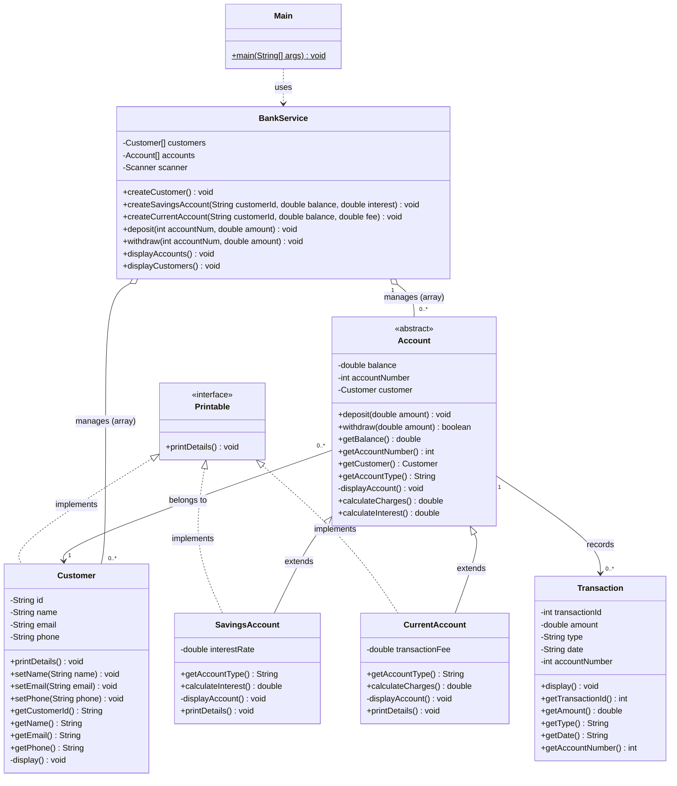

# Banking mini UML

```mermaid
classDiagram
    class Printable {
        <<interface>>
        +printDetails() void
    }

    class Customer {
        -String id
        -String name
        -String email
        -String phone
        +printDetails() void
        +setName(String name) void
        +setEmail(String email) void
        +setPhone(String phone) void
        +getCustomerId() String
        +getName() String
        +getEmail() String
        +getPhone() String
        -display() void
    }

    class Account {
        <<abstract>>
        -double balance
        -int accountNumber
        -Customer customer
        +deposit(double amount) void
        +withdraw(double amount) boolean
        +getBalance() double
        +getAccountNumber() int
        +getCustomer() Customer
        +getAccountType() String
        -displayAccount() void
        +calculateCharges() double
        +calculateInterest() double
    }

    class SavingsAccount {
        -double interestRate
        +getAccountType() String
        +calculateInterest() double
        -displayAccount() void
        +printDetails() void
    }

    class CurrentAccount {
        -double transactionFee
        +getAccountType() String
        +calculateCharges() double
        -displayAccount() void
        +printDetails() void
    }

    class Transaction {
        -int transactionId
        -double amount
        -String type
        -String date
        -int accountNumber
        +display() void
        +getTransactionId() int
        +getAmount() double
        +getType() String
        +getDate() String
        +getAccountNumber() int
    }

    class BankService {
        -Customer[] customers
        -Account[] accounts
        -Scanner scanner
        +createCustomer() void
        +createSavingsAccount(String customerId, double balance, double interest) void
        +createCurrentAccount(String customerId, double balance, double fee) void
        +deposit(int accountNum, double amount) void
        +withdraw(int accountNum, double amount) void
        +displayAccounts() void
        +displayCustomers() void
    }

    class Main {
        +main(String[] args)$ void
    }

    %% Interface Implementations
    Printable <|.. Customer : implements
    Printable <|.. SavingsAccount : implements
    Printable <|.. CurrentAccount : implements

    %% Inheritance
    Account <|-- SavingsAccount : extends
    Account <|-- CurrentAccount : extends

    %% Direct Relationships
    Account "0..*" --> "1" Customer : belongs to
    Account "1" --> "0..*" Transaction : records

    %% Management / Dependency
    Main ..> BankService : uses
    BankService "1" o-- "0..*" Customer : manages (array)
    BankService "1" o-- "0..*" Account : manages (array)
```