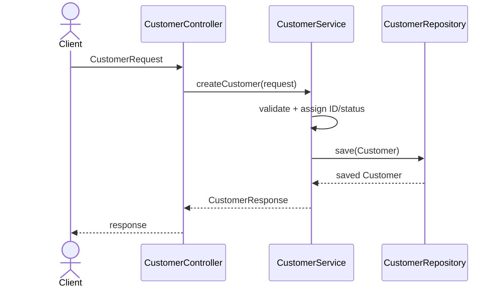

```mermaid
sequenceDiagram
    actor Client
    participant C as CustomerController
    participant S as CustomerService
    participant R as CustomerRepository

    Client->>C: CustomerRequest
    C->>S: createCustomer(request)
    S->>S: validate + assign ID/status
    S->>R: save(Customer)
    R-->>S: saved Customer
    S-->>C: CustomerResponse
    C-->>Client: response
```