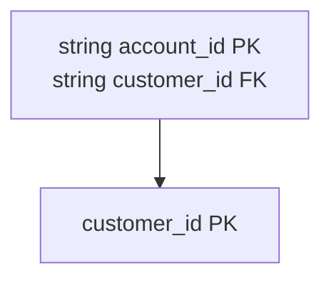

erDiagram
CUSTOMER ||--o{ ACCOUNT : owns
CUSTOMER {
string customer_id PK
}}
ACCOUNT {
string account_id PK
string customer_id FK
}

```mermaid
flowchart TB
    ACCOUNT["string account_id PK<br/> string customer_id FK"]
    ACCOUNT --> CUSTOMER["customer_id PK"]
```
